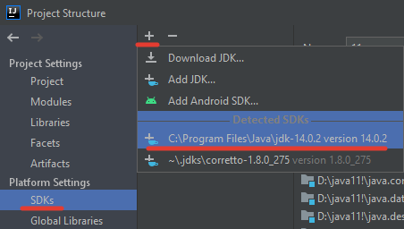
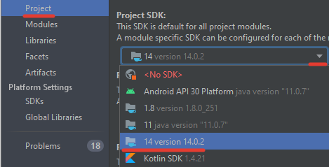
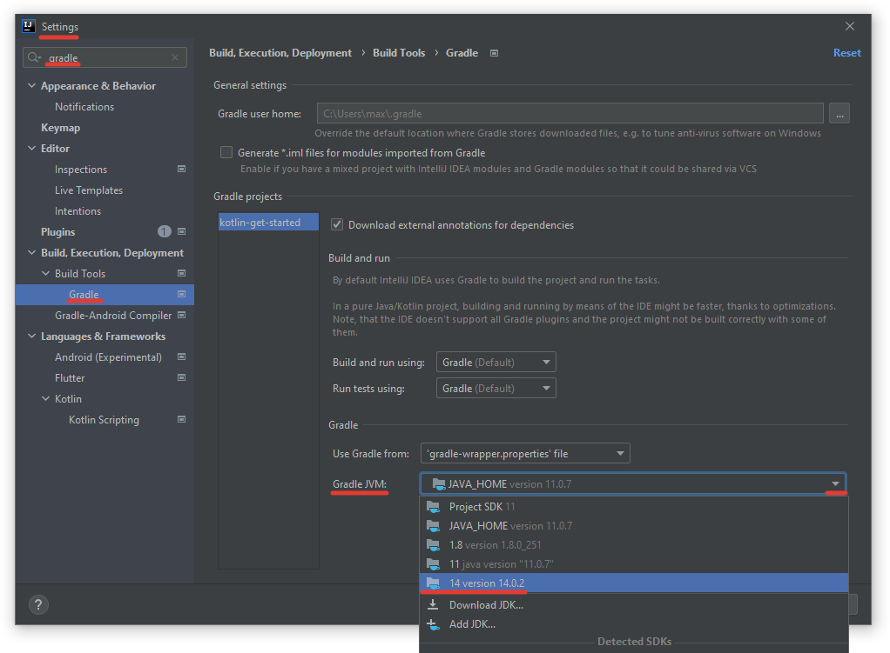

Kotlin in IntelliJ Idea
---

- Install JDK (for example [Oracle JDK 14](https://download.oracle.com/otn/java/jdk/14.0.2+12/205943a0976c4ed48cb16f1043c5c647/jdk-14.0.2_windows-x64_bin.exe))
- Open this folder (with `build.gradle`) as project in Idea
- Add JDK to project: press `F4` on left `Project Tool` -> `SDk` -> `Add` -> `Apply`
  
  
- Set new SDK to project: press `F4` on left `Project Tool` -> `Project` -> `Project SDK` -> `Set new SDK` -> `OK`
  
  
- Set new SDK to `Gradle Build Tool`: press `Ctrl + Alt + S` -> Find `gradle` in search -> Go to `Gradle JVM` -> Set new SDK -> `OK`
  
  

- Create new directory `src/main/kotlin/main.kt` with code
```kotlin
fun main() {
    val jdk = System.getProperty("java.version")
    println("Using JDK: $jdk")
}
```

- Go to `main.kt` in Editor and press `Ctrl + Shift + F10` and you must see your JDK version in console like: `Using JDK: 14.0.2`